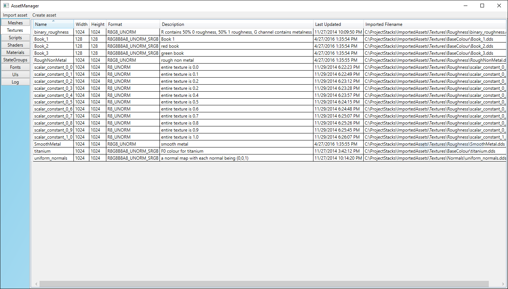

# AssetManager

Converts game assets such as meshes, shaders, scripts to a custom binary format used by Project Stacks and Chengine. To learn more visit http://patrick-lafferty.github.io/projects/projectstacks.

# Features

* Fonts
    * Creates Signed Distance Fields from a font family rendered with GDI to create high quality, efficient text that looks good at any scale
    * Uses QuadTrees and multithreading to minimize the time to generate an SDF

* Images
    * Flexible texture packer that allows you to pick individual channels from up to 4 images to pack into one 4 channel texture
    * Saves textures in DDS format

* Meshes
    * Reads standard mesh formats like Wavefronts (*.objs) using Assimp
    * Stores vertex/index count, axis aligned bounding box, and input layouts in the header
    * Writes vertex data into separate streams (position, index, normal/texcoords) designed to be efficiently loaded with a simple memcpy into a D3D11 Buffer

* Shaders
    * Compiles shaders offline with FXC
    * Uses reflection to analyze the shader bytecode to find all the constant buffers the shader uses so the variable descriptions, formats and sizes can be saved with the compiled shader, reducing the work the engine needs to do at runtime

# Building
1. clone [assimp](https://github.com/assimp/assimp) into Dependencies/assimp. 
2. run CMake for assimp (set LIBRARY_SUFFIX to empty string when generating), build Assimp.sln
3. build AssetManager.sln, requires Visual Studio 2015.

# Usage
AssetManager expects:
* a path where raw assets are stored (wavefront meshes: *.obj. shaders: *.hlsl)
* a path where it can store metadata for assets
* a path where it saves the binary imported assets to

Typically you would have a layout like this:

├── Game  
│   ├── RawAssets  
│   │   └── Metadata  
│   ├── ImportedAssets
